<h1>Faizan Ali</h1>

Full Stack Developer &nbsp;·&nbsp; Bengaluru, India

 
 

 
 

<samp>❯ connect --via</samp>&nbsp;&nbsp;
<a href="https://linkedin.com/in/md-faizan-ali"><samp>linkedin</samp></a> ·
<a href="https://leetcode.com/u/thisisfaizanali/"><samp>leetcode</samp></a> ·
<a href="https://github.com/thisisfaizanali"><samp>github</samp></a> ·
<a href="mailto:faizanaliwhb@gmail.com"><samp>email</samp></a>

 

<table width="100%">
<tr>
<td width="50%" valign="top">

<samp>❯ cat about.md</samp>

I build fast, type-safe web applications with clean architecture and sharp UX — mostly across the React and Next.js ecosystem, increasingly with LLMs wired into real product workflows.

**Currently:** leaning on AI tools and LLMs to learn and ship faster, while staying deliberate about keeping the fundamentals sharp.

Open to collaborating on full-stack projects, open-source tools, or anything AI-integrated.

</td>
<td width="50%" valign="top">

<samp>❯ ls ~/stack</samp>

Languages
 

Frontend
 

Backend &amp; DB
 

Tools
 

</td>
</tr>
<tr>
<td width="50%" valign="top">

<samp>❯ ./solve --stats</samp>

**LeetCode** &nbsp;·&nbsp; 600+ Problems Solved
 
[thisisfaizanali](https://leetcode.com/u/thisisfaizanali/)

 

**GeeksforGeeks** &nbsp;·&nbsp; Institute Rank #2
 
Weekly Contest 167 &nbsp;·&nbsp; Rank 587
 
[thisisfaizanali](https://www.geeksforgeeks.org/user/thisisfaizanali/)

</td>
<td width="50%" valign="top">

<samp>❯ git log --stat</samp>

</td>
</tr>
</table>

 

<samp># thanks for stopping by — always happy to connect.</samp>

