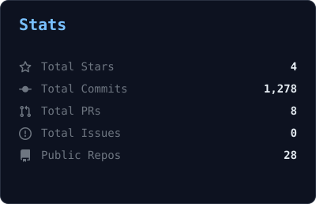
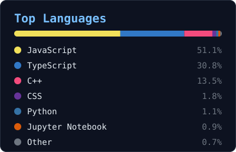

<h1>👋 Glad you're here! I'm Faizan Ali.</h1>

 

<samp>❯&nbsp;connect&nbsp;--via</samp>&nbsp;&nbsp;&nbsp;
&nbsp;&nbsp;
&nbsp;&nbsp;
&nbsp;&nbsp;

 

 

I build fast, type-safe web applications with clean architecture and sharp UX — mostly across the React and Next.js ecosystem, increasingly with LLMs wired into real product workflows.

**Currently:** leaning on AI tools and LLMs to learn and ship faster, while staying deliberate about keeping the fundamentals sharp.

Open to collaborating on full-stack projects, open-source tools, or anything AI-integrated.

 

 

**LANGUAGES**
 

**FRONTEND**
 

**BACKEND · DB**
 

**TOOLING**
 

 

 

**LeetCode** &nbsp;·&nbsp; 700+ problems solved
 
<a href="https://leetcode.com/u/thisisfaizanali/">leetcode.com/u/thisisfaizanali</a>

**GeeksforGeeks** &nbsp;·&nbsp; Institute Rank #2
 
Weekly Contest 167 &nbsp;·&nbsp; Rank 587
 
<a href="https://www.geeksforgeeks.org/user/thisisfaizanali/">geeksforgeeks.org/user/thisisfaizanali</a>

 

 

&nbsp;&nbsp;

 

 

<samp># thanks for stopping by — always happy to connect.</samp>

